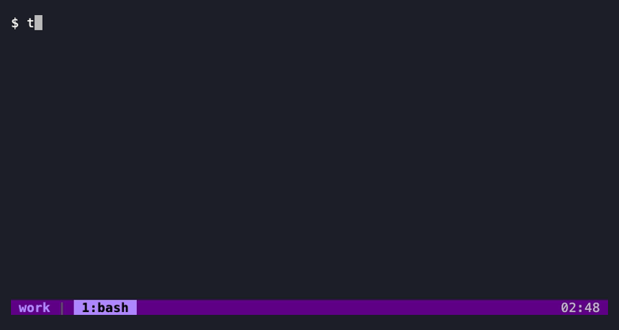
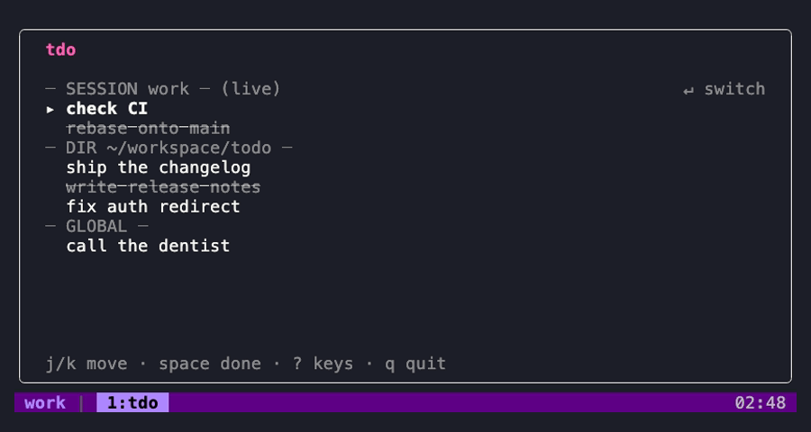

# tmux-todo (`tdo`)

[](https://github.com/agusarias/tdo/actions/workflows/ci.yml)
[](https://github.com/agusarias/tdo/releases/latest)
[](https://goreportcard.com/report/github.com/agusarias/tmux-todo)

A tmux-native TODO manager with sesh-style ergonomics: a keybind opens a popup
where you create, complete, delete and re-scope tasks. Tasks carry one of three
independent scopes — `session`, `dir` or `global` — so returning to a session or
a project brings back its pending action items.



The popup stays open across actions — toggle a few tasks, add two more, filter
down to one scope, jump to the all-tasks view — all without reopening it. It's
a real recording of `tdo tui` running in a tmux pane, not a mockup.

- **Three independent scopes.** `session` follows a tmux session by name, `dir`
  follows a git repo (worktrees fold into their parent), `global` is everywhere.
- **The popup never closes on you.** Add, complete, edit, re-scope and delete in
  one sitting; `u` undoes a delete until you quit.
- **Everything's scriptable.** `tdo add`/`list`/`done`/`rm`/`count` work outside
  the popup too, and `list --json` is a stable, versioned contract.
- **One static binary, one SQLite file.** Pure-Go `modernc.org/sqlite` —
  `CGO_ENABLED=0`, no libsqlite3, nothing else to install.
- **Cold start is the product.** ~8ms process start; the popup opens about as
  fast as you can let go of the key.

## Install

### With TPM

```tmux
set -g @plugin 'agusarias/tmux-todo'
set -g @todo-key 't'          # optional; 't' is the default
set -g @todo-key-table 'root' # optional; 'prefix' is the default
```

Then `prefix + I` to install, and `prefix + t` opens the popup.

Both options are read when the plugin runs, so they have to be set **before**
its `@plugin` line — the usual order in a `tmux.conf` anyway.

The plugin needs a `tdo` binary and finds one in this order, stopping at the
first success:

1. `tdo` on your `$PATH` — so your own install always wins
2. `bin/tdo` inside the plugin directory — a binary we downloaded or built earlier
3. otherwise it **downloads** the release binary for your platform, **once** — so
   you do not need a Go toolchain
4. failing that, it builds one with `go build`, once, if `go` 1.25 or newer is
   available
5. if none of that works, **no keybind is installed** and tmux shows a message
   saying why

Step 5 is deliberate: a keybind pointing at a missing binary looks like the
plugin's fault when you press the key, which is a worse failure than being told
at install time. If you see that message, either put `tdo` on your `$PATH` or run
`make build` in the plugin directory.

Steps 1 and 2 are the steady state, and they do no build and touch no network —
tmux re-runs the plugin script on every server start, so that path stays cheap.
The download in step 3 happens on a first install and never again.

**About step 3.** The download comes from this repository's latest GitHub release
over HTTPS, and its SHA-256 is checked against the release's `checksums.txt`
before the file is moved into place:

- sums match → the binary is used;
- sums **disagree** → the download is deleted and the plugin falls through to
  step 4. It is never executed;
- `checksums.txt` cannot be fetched, or the machine has no `sha256sum`/`shasum` →
  the binary is used **unverified**, and tmux says so, once. This is the
  deliberate trade: a missing checksums file should not block an install. If you
  would rather it did, install `tdo` yourself (step 1) or build from source.

Binaries are published for `darwin/arm64`, `darwin/amd64`, `linux/amd64` and
`linux/arm64`. Any other platform, no network, no `curl` **and** no `wget`, or a
release with no asset for you: the step is skipped and step 4 gets its turn.
Nothing here can fail your tmux server start.

Set `TDO_RELEASE_BASE_URL` in the environment tmux starts in to fetch from a
mirror instead.

<details>
<summary><h3>Without TPM</h3></summary>

#### From a release binary

No toolchain needed. Pick the asset for your platform — `tdo-darwin-arm64`,
`tdo-darwin-amd64`, `tdo-linux-amd64` or `tdo-linux-arm64` — and verify it before
you run it:

```sh
base=https://github.com/agusarias/tmux-todo/releases/latest/download
asset=tdo-darwin-arm64                      # your platform

curl -fsSLO "$base/$asset"
curl -fsSLO "$base/checksums.txt"
grep " $asset\$" checksums.txt | shasum -a 256 -c -   # sha256sum -c - on Linux

chmod +x "$asset"
mv "$asset" ~/.local/bin/tdo                # anywhere on your $PATH
```

`tdo --version` should print the release tag. The binary is one static file with
no runtime dependencies, so uninstalling is deleting it.

#### From source

```sh
git clone https://github.com/agusarias/tmux-todo
cd tmux-todo
make build && cp bin/tdo ~/.local/bin/   # anywhere on your $PATH
```

Either way, point tmux at the plugin script:

```tmux
set -g @todo-key 't'            # optional, and must precede the run-shell
set -g @todo-key-table 'prefix' # optional, likewise
run-shell '/path/to/tmux-todo/tmux-todo.tmux'
```

`run-shell`-ing the plugin script is all TPM does, so this gets you the same
keybind and the same rename hook. If you would rather not run the script at all,
it is short and readable — copy the `bind-key` and `set-hook` lines out of it and
substitute your own path.

</details>

## Configuration

| Option | Default | Meaning |
|---|---|---|
| `@todo-key` | `t` | The key that opens the popup |
| `@todo-key-table` | `prefix` | Which key table that key lives in: `prefix`, or `root` for no prefix at all |

`root` is for a config that has already spent its `C-<key>` space on tmux rather
than on readline — `set -g @todo-key 'C-l'` with `@todo-key-table 'root'` opens
the popup on a bare Ctrl-l, at the cost of that pane's clear-screen. Only those
two table names are accepted; anything else falls back to `prefix` with a message,
since a custom table is reachable only through a `switch-client -T` binding you
own.

Those are the only options. The popup's size is fixed on purpose (≈60% × 60%, never
smaller than 60 × 15): below that floor the popup's own footer starts truncating,
so a user-settable size would silently break the frame.

## Keys in the popup

| Key | Does |
|---|---|
| `j` / `k` | move the cursor |
| `space` | toggle done — the row stays visible, struck through, until you close |
| `a` | add a task on an inline row; `Tab` cycles its scope, `Enter` saves |
| `e` | edit the row's text in place |
| `s` | cycle the row's scope |
| `d` / `u` | delete a row / undo that (until the popup closes) |
| `1` / `2` / `3` | filter to one scope tier |
| `g` | the all-tasks view: every task, grouped by scope |
| `Enter` | in the all-tasks view, jump to that session (and close) |
| `r` / `D` | in the all-tasks view, re-home a group / delete a group |
| `?` | the full keymap, and the version |
| `q` / `Esc` | close |

Deletes are queued and only written when the popup closes, which is what lets
`u` bring a row back with its original id, timestamp and position.

The all-tasks view (`g`) groups every task by scope, marks which sessions are
still running, and lets `Enter` jump you to one:



## From the command line

Everything in the popup is reachable non-interactively:

```sh
tdo add "fix flaky test" [--session|--dir|--global]
tdo list [--scope=session|dir|global|all] [--json]
tdo done <id>
tdo rm <id>
tdo count [--pending]
tdo doctor          # schema version, journal mode, task counts
```

`tdo list --json` is a stable contract — an object wrapper, RFC3339 UTC
timestamps and a nested `scope` — so it is safe to script against. Outside tmux
everything works except `session` scope, which does not exist there.

## sesh integration (optional)

In the all-tasks view, `Enter` on a task belonging to a session that is not
running uses [sesh](https://github.com/joshmedeski/sesh) (`sesh connect -s`) to
bring that session back with its directory and startup command. If `sesh` is not
installed, or does not know the name, tdo falls back to `tmux new-session -d` +
`switch-client`. sesh is an enhancement, never a dependency.

## Where your data lives

One SQLite database:

```
$XDG_DATA_HOME/tmux-todo/tasks.db      # if XDG_DATA_HOME is set
~/.local/share/tmux-todo/tasks.db      # otherwise
```

It runs in WAL mode, so `tasks.db-wal` and `tasks.db-shm` sit beside it while a
process has it open; include them in any backup. `tdo doctor` reports the schema
version and journal mode.

Session-scoped tasks are filed under the session **name**, so tdo installs a
`session-renamed` hook that moves them when you rename a session. The hook is
appended (`set-hook -ga`), so your own `session-renamed` hooks keep working.

## Building from source

**Requires Go 1.25 or newer** — that is the floor `modernc.org/sqlite` needs.

```sh
make build        # CGO_ENABLED=0 static binary at ./bin/tdo
make test         # go test ./...
make test-plugin  # the tmux plugin's shell harness (needs a tmux binary)
make lint         # go vet + gofmt check
```

The binary is pure Go and statically linked — no libsqlite3, nothing to install
alongside it.

See `docs/design.md` for the agreed design and `docs/tasks/` for the work queue.
